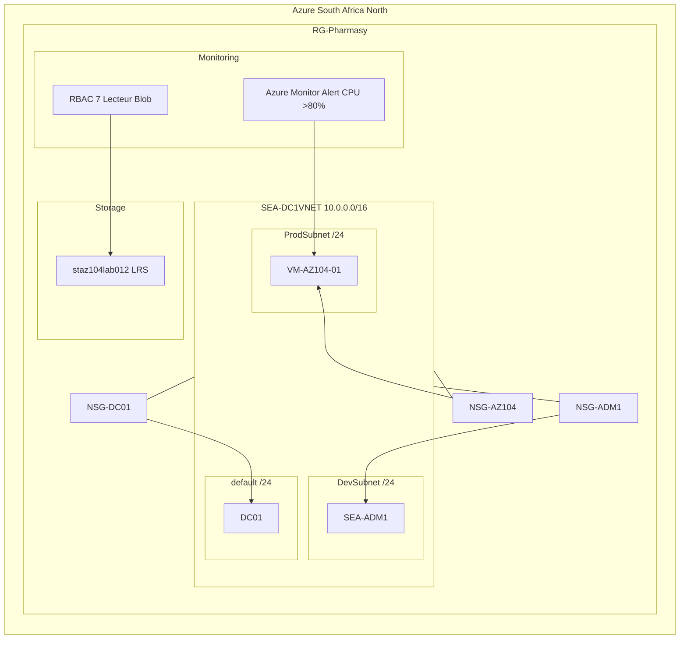

# RG-Pharmasy Architecture Diagram - AZ-104 Lab

## Azure Resource Group: RG-Pharmasy

## Resource Map

| Subgraph | Component | Type | Details |
|---|---|---|---|
| **RG-Pharmasy** | Resource Group | RG | Azure South Africa North |
| **SEA-DC1VNET** | Virtual Network | VNet | 10.0.0.0/16 |
| | default /24 | Subnet | DC01 host subnet |
| | DevSubnet /24 | Subnet | SEA-ADM1 dev subnet |
| | ProdSubnet /24 | Subnet | VM-AZ104-01 prod subnet |
| **Compute** | DC01 | VM | Windows Server - Stopped |
| | SEA-ADM1 | VM | Windows Server - Stopped |
| | VM-AZ104-01 | VM | Linux - Stopped |
| **Storage** | staz104lab012 | Storage Account | LRS Blob Storage |
| **Network** | NSG-DC01 | NSG | DC01 NSG |
| | NSG-ADM1 | NSG | SEA-ADM1 NSG |
| | NSG-AZ104 | NSG | VM-AZ104-01 NSG |
| **Monitor** | Azure Monitor | Monitor | CPU Alert > 80% |
| | RBAC | Access Control | 7 Lecteur Blob assignments |
